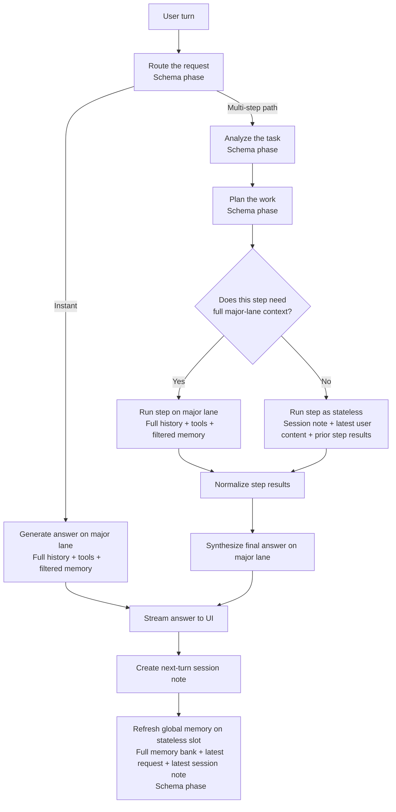
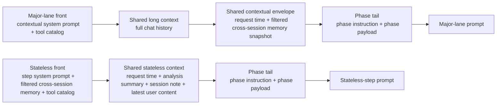
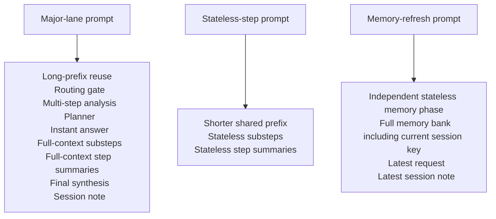

# Chat Studio


[](./LICENSE)  

Chat Studio is a full-stack multimodal chat workspace built with Next.js on top of OpenAI-compatible backends.

The app now ships with two workflows in one interface:

- `Legacy Custom Mode`: free-form chat, compare mode, structured extraction, and manual model controls.
- `Intelligent Mode (v2)`: deployer-defined modes, server-side orchestration, session-aware traces, cross-session memory, and optional MCP tool usage.

## Highlights

- Dual-workspace app with a runtime switch between legacy chat and intelligent modes
- Responsive desktop and mobile layout for both legacy and intelligent workspaces
- Streaming chat with image and PDF attachments
- Markdown, GitHub-flavored tables, and KaTeX math rendering
- Regenerate and Edit & Resend flows in both legacy and intelligent usage paths
- Local browser persistence through IndexedDB and `localStorage`
- Structured output mode with Schema Workspace and JSON / CSV export
- Intelligent orchestration traces with route, lane, reasoning mode, and phase metrics
- Session summaries plus editable three-tier cross-session memory in intelligent mode
- Optional MCP integration with Streamable HTTP and FastMCP-style SSE transports
- Standalone Docker deployment for production

## Quick Start

### 1. Install dependencies

```bash
npm install
```

### 2. Create `.env.local`

```env
# One of these backend URLs is required
OPENAI_COMPAT_BASE_URL=http://127.0.0.1:8080/v1
LLAMA_SERVER_BASE_URL=http://127.0.0.1:8080

# Optional auth for the LLM backend
LLM_API_KEY=your_api_key
OPENAI_COMPAT_API_KEY=your_api_key

# Optional UI title
APP_TITLE=Chat Studio

# Optional intelligent mode toggle
INTELLIGENT_MODE=1

# Optional intelligent mode config path
INTELLIGENT_CONFIG_PATH=./intelligent.config.yaml

# Optional auth for MCP servers
MCP_SERVER_AUTH_TOKEN=your_mcp_token
```

### 3. Start the development server

```bash
npm run dev
```

By default, `npm run dev` uses `next dev --webpack`. This avoids current Turbopack dev-cache issues seen in some Windows / OneDrive paths. If you want Turbopack explicitly, use:

```bash
npm run dev:turbopack
```

Open `http://localhost:3000`.

## Environment Variables

| Variable | Required | Purpose |
| --- | --- | --- |
| `OPENAI_COMPAT_BASE_URL` | Yes, unless `LLAMA_SERVER_BASE_URL` is set | OpenAI-compatible `/v1` endpoint. |
| `LLAMA_SERVER_BASE_URL` | Yes, unless `OPENAI_COMPAT_BASE_URL` is set | Root llama-server URL. The app derives `/v1` automatically when needed. |
| `LLM_API_KEY` | No | Preferred auth token for the LLM backend. |
| `OPENAI_COMPAT_API_KEY` | No | Backward-compatible fallback for `LLM_API_KEY`. |
| `APP_TITLE` | No | App title shown in the UI. |
| `INTELLIGENT_MODE` | No | Enables the intelligent workspace when truthy (`1`, `true`, `yes`, `on`, `enabled`). |
| `INTELLIGENT_CONFIG_PATH` | No | Relative or absolute path to the intelligent config file. Defaults to `intelligent.config.yaml`, `intelligent.config.yml`, or `intelligent.config.json` in the app root. |
| `MCP_SERVER_AUTH_TOKEN` | No | Optional bearer token sent to the configured MCP server. |

## Intelligent Mode

When `INTELLIGENT_MODE=1` and a config file is present, Chat Studio exposes:

- `GET /api/intelligent/modes`
- `POST /api/intelligent/chat`

The UI adds a top-level workspace selector so you can switch between `Legacy Custom Mode` and any configured intelligent mode.

### What v2 currently includes

- Deployer-defined intelligent modes loaded from YAML or JSON
- Per-turn orchestration traces with phase summaries and expandable details
- Session-aware chat flow with persisted next-turn summaries for stateless recovery
- Editable three-tier memory store:
  user features, instruction memory, and recent events
- Optional MCP tool usage from the server-side orchestrator
- KV / PP / TG metrics when `LLAMA_SERVER_BASE_URL` is explicitly configured
- Intelligent turn replay through `Edit & Resend` and `Regenerate`
- Single in-flight intelligent request protection for predictable state updates

### Example config

See [intelligent.config.yaml.example](./intelligent.config.yaml.example).

```yaml
version: 1
default_mode: standard
mcp_server: https://mcp.server.example

modes:
  standard:
    label: Intelligent Standard
    major_model: Qwen3.5-27b
    models:
      Qwen3.5-27b:
        weight: 27
        slots:
          contextual: 0
          stateless: 1
      Qwen3.5-4b:
        weight: 4

  flash:
    label: Intelligent Flash
    major_model: Qwen3.5-4b
    models:
      Qwen3.5-27b:
        weight: 27
      Qwen3.5-4b:
        weight: 4
        slots:
          contextual: 0
          stateless: 1
```

### Intelligent mode notes

- `modes` is an arbitrary object map, so you can define any number of intelligent workspaces.
- `major_model` must also exist inside the mode's `models` map.
- `models.<model-id>` can be either a number shorthand or an object with `weight` and optional `slots`.
- `weight` drives stateless model routing and should usually reflect relative model size or capability, such as parameter count in billions. Exact values do not need to be perfect, but the ordering should be meaningful.
- `mcp_server` is optional. When present, the intelligent orchestrator can enumerate and call MCP tools.
- MCP integration supports both Streamable HTTP and FastMCP-style SSE transports.
- `MCP_SERVER_AUTH_TOKEN` is optional and is sent as `Authorization: Bearer <token>` when provided.
- If only `LLAMA_SERVER_BASE_URL` is set, the app derives the OpenAI-compatible `/v1` endpoint automatically.
- Native llama-server features such as slot pinning and per-phase KV metrics are enabled only when `LLAMA_SERVER_BASE_URL` is explicitly set.

## Docker Deployment

This project uses a multi-stage `Dockerfile` that builds the Next.js standalone output and runs it with Node.js in production mode.

### Build the image

```bash
docker build -t chat-studio .
```

### Run legacy mode only

```bash
docker run --rm -p 3000:3000 --env-file .env.local chat-studio
```

### Run intelligent mode with an external config file

```bash
docker run --rm -p 3000:3000 \
  --env-file .env.production \
  -e INTELLIGENT_MODE=1 \
  -e INTELLIGENT_CONFIG_PATH=/app/intelligent.config.yaml \
  -v /absolute/path/to/intelligent.config.yaml:/app/intelligent.config.yaml:ro \
  chat-studio
```

### Run against a backend on the host machine

```bash
docker run --rm -p 3000:3000 \
  -e OPENAI_COMPAT_BASE_URL=http://host.docker.internal:8080/v1 \
  -e LLM_API_KEY=your_api_key \
  -e APP_TITLE="Chat Studio" \
  chat-studio
```

### Docker notes

- The container listens on port `3000`.
- Environment variables are read at runtime, not at image build time.
- For intelligent mode, prefer mounting the real config file at runtime instead of baking it into the image.
- If your backend runs on the Docker host, do not use `127.0.0.1` inside the container. Use `host.docker.internal`.
- The repo's `.dockerignore` excludes local env files and local intelligent config files so accidental secrets are not copied into the build context.
- Local archives, dev output directories, and other large non-runtime files are excluded from Docker build context, and clearly non-runtime files are excluded from output tracing, so the standalone image stays smaller without dropping required Next.js runtime chunks.

## Usage Overview

### Legacy Custom Mode

Use the legacy workspace when you want direct manual control over the model and generation settings.

- Select a model
- Edit the system prompt
- Switch between `Normal` and `Structured`
- Use `Compare 2` or `Compare 3`
- Export structured results as JSON or CSV

### Intelligent Mode

Use the intelligent workspace when you want the server-side orchestrator to manage routing and context.

- Select a configured intelligent mode from the top workspace switcher
- Send text, images, or PDF pages
- Inspect the live orchestration trace for each assistant reply
- Reopen and edit cross-session memory from the sidebar
- Re-run a previous turn with `Edit & Resend` or `Regenerate`

## Architecture

Chat Studio is implemented as a full-stack Next.js application.

### Frontend

- App Router UI with a legacy workspace and an intelligent workspace
- Browser-side attachment handling for images and PDFs
- IndexedDB persistence for conversations and attachments
- `localStorage` persistence for active workspace selection and active conversation ids

### Backend

- `/api/models` discovers models from the configured OpenAI-compatible backend
- `/api/chat` proxies legacy chat requests
- `/api/intelligent/modes` exposes deployer-defined intelligent modes
- `/api/intelligent/chat` runs the intelligent orchestration pipeline

### Intelligent orchestration

The intelligent path can:

- Route each request into a direct-answer path or a decomposed path
- Keep full-history work on one reusable prompt shape
- Let stateless substeps fall back to a shorter reusable prompt shape when full-session context is unnecessary
- Call optional MCP tools when a server is configured
  MCP tools are external tools exposed by an MCP server.
- Normalize intermediate step results before final synthesis
- Write a short note for the next turn, then refresh cross-session memory after the answer is finished
- Emit structured phase updates back to the UI through server-sent events (SSE)

## Intelligent Workflow

Terms used below:

- `major lane`
  The fixed full-context stack: major model + tool catalog + cross-session memory except the current session key + full chat history.
- `stateless step`
  A cheaper substep that does not receive the full chat history.
- `schema phase`
  A phase that uses `json_schema` response formatting instead of prompt-only JSON instructions.

The intelligent workflow is built around three ideas:

- Keep every user-facing answer on the `major lane`.
- Let only substeps choose between `major lane` and `stateless step`.
- Move session-note and global-memory updates to after the answer finishes.

### End-to-end timeline



This is a serial post-answer flow: the session note is prepared first, and the global memory refresh happens after that. They are related housekeeping stages, not parallel branches.

### Prompt structure and prefix cache reuse



Prompt shape:

- `Major-lane prompt`
  `contextual system prompt + tool catalog -> full chat history -> request time + filtered cross-session memory snapshot -> phase instruction + phase payload`
- `Stateless-step prompt`
  `step system prompt + filtered cross-session memory + tool catalog -> request time + analysis summary + session note + latest user content -> phase instruction + phase payload`

Where the reusable prefix comes from:

- `Major-lane front`
  `contextual system prompt + tool catalog`
- `Shared long context`
  `full session history`
- `Shared contextual envelope`
  `request time + cross-session memory excluding the current session key`
- `Stateless front`
  `step system prompt + filtered cross-session memory + tool catalog`
- `Shared stateless context`
  `request time + analysis summary + previous-turn session note + latest user content`



The long reusable prefix is the `major lane` stack. Final answers never drop out of it. Only internal step work, such as stateless substeps and stateless step summaries, may choose the shorter stateless prompt shape.

The memory refresh phase is separate. It does not reuse the major-lane long prefix and it does not use the substep stateless prompt. It runs on the stateless slot with a dedicated memory-refresh prompt.

There is no rolling history window in the current architecture. A substep either receives the whole major-lane stack or it receives the stateless step prompt.

### Schema phases

- `Routing gate`
  Structured output: `shouldUseInstant`, `gateSummary`
- `Multi-step analysis`
  Structured output: `difficultyScore`, `recommendedStepCount`, `taskType`, `groundingNeed`, `complexityFactors`, `analysisSummary`
- `Planner`
  Structured output: ordered steps with `id`, `title`, `objective`, `difficultyScore`, `needsFullContext`, `groundingNeed`
- `Step summary`
  Structured output: `briefSummary`, `summary`
- `Global memory refresh`
  Structured output: `userFeatures`, `instructionMemory`, `recentEvents`
  Input: full current memory bank, latest user request, latest session note

### System roles

- `Router`
  Decides whether the request can be answered directly or should be decomposed first.
- `Planner`
  Turns complex requests into a small number of focused steps instead of one large opaque generation.
- `Executors`
  Run each step either on the full major-lane stack or as a stateless step.
- `Synthesizer`
  Combines grounded step results into the final user-facing answer on the major lane.
- `Memory layer`
  Writes a short note for the next turn first, then updates cross-session memory after the answer is done.

### Operating principles

- The full conversation is the authoritative state for all major-lane work.
- Complex requests are decomposed before execution, so the system can reason in smaller grounded steps.
- Only substeps are allowed to opt out of the full context stack.
- Tool use is attached to the execution path, not treated as a separate architecture.
- Post-answer memory work is sequential and isolated from answer generation.

### What stays stable across turns

- The overall pipeline shape: route, optionally decompose, execute, synthesize, then update memory.
- The major-lane prompt shape used by all user-facing answer phases.
- The separation between live reasoning and post-answer memory maintenance.

### What changes across turns

- The conversation itself grows.
- Some requests stay simple and take the direct path; others branch into multi-step execution.
- Substeps may switch between major-lane execution and stateless execution.
- Tools, retrieved facts, and cross-session memory contents change the later parts of the workflow.
- The exact plan, execution results, and final synthesis depend on the current request.

## Dependencies

### Core

- [Next.js](https://nextjs.org/)
- [React](https://react.dev/)
- [TypeScript](https://www.typescriptlang.org/)

### UI and Rendering

- [Tailwind CSS](https://tailwindcss.com/)
- [shadcn/ui](https://ui.shadcn.com/)
- [Radix UI](https://www.radix-ui.com/)
- [lucide-react](https://github.com/lucide-icons/lucide)
- [react-markdown](https://github.com/remarkjs/react-markdown)
- [remark-gfm](https://github.com/remarkjs/remark-gfm)
- [remark-math](https://github.com/remarkjs/remark-math)
- [rehype-katex](https://github.com/remarkjs/remark-math/tree/main/packages/rehype-katex)

### File Handling and Persistence

- [react-dropzone](https://react-dropzone.js.org/)
- [pdfjs-dist / PDF.js](https://github.com/mozilla/pdf.js)
- [idb](https://github.com/jakearchibald/idb)

## Security Notes

- Provider credentials stay server-side.
- Browser clients never call the upstream LLM provider directly.
- Conversations and attachments are stored locally in the browser unless your deployment adds external persistence.
- Local env files and local intelligent config files should not be committed to version control.

## License

Apache License 2.0. See [LICENSE](./LICENSE).
