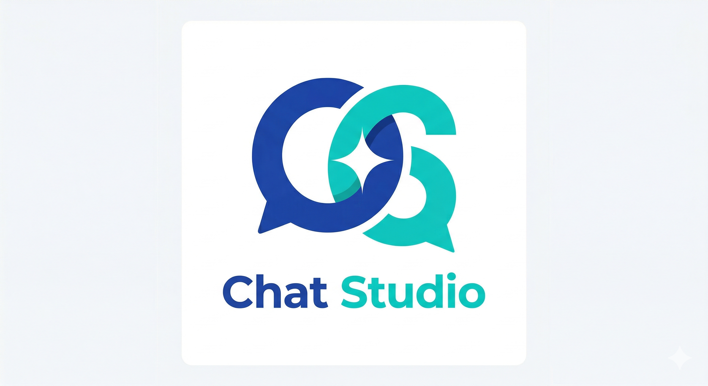

# Chat Studio


[](https://opensource.org/licenses/MIT)  

Chat Studio is a modern multimodal chat workspace built on top of an OpenAI-compatible backend.

It combines real-time streaming chat, compare mode, multimodal input, browser-side conversation persistence, and structured extraction workflows in a single interface.

## Highlights

- Streaming chat with real-time token rendering
- Model selection through an OpenAI-compatible provider
- Custom system prompt
- Adjustable generation parameters
- Think / Instant mode
- Compare 2 / Compare 3 responses
- Regenerate and Edit & Resend
- Stop generation
- Browser-side conversation persistence
- Image upload
- PDF upload with page-to-image parsing
- Markdown rendering
- Collapsible reasoning display
- Structured output mode
- Schema Workspace for extraction tasks
- Export structured results as JSON / CSV

## Getting Started

### 1. Install dependencies

```bash
npm install
```

### 2. Create environment variables

Create a `.env.local` file in the project root:

```env
OPENAI_COMPAT_BASE_URL=your_api_url (e.g. http://127.0.0.1:8080/)
# Optional if your backend requires auth
OPENAI_COMPAT_API_KEY=your_api_key
APP_TITLE=Chat Studio
```

### 3. Start the development server

```bash
npm run dev
```

Open the app in your browser:

```text
http://localhost:3000
```

## Usage

### Basic Chat

1. Select a model
2. Enter a prompt
3. Adjust settings if needed
4. Send the request
5. View the streaming result

### Compare Mode

1. Choose `Compare 2` or `Compare 3`
2. Send one prompt
3. Review multiple outputs side by side

### Multimodal Chat

1. Drag images or PDFs into the composer
2. Add optional text instructions
3. Send the request
4. Review the generated response

### Structured Extraction

1. Switch `Output Mode` to `Structured`
2. Open `Schema Workspace`
3. Define extraction fields
4. Upload an image or PDF
5. Send the request
6. Export the result as JSON or CSV

## Security

- Provider configuration is stored on the server side through `.env.local`
- API keys are not exposed to the browser
- `.env.local` should never be committed to version control
- Available models are discovered dynamically from `${OPENAI_COMPAT_BASE_URL}/models`

## Architecture

Chat Studio is implemented as a full-stack Next.js application.

### Frontend

The frontend is built with the App Router and a three-panel layout:

- **Conversation Sidebar** for local chat sessions
- **Chat Panel** for streaming responses and compare mode
- **Settings Panel** for model, prompt, generation, and structured output controls

### Backend Proxy

The browser does not call the model provider directly.

Instead, the application uses Next.js Route Handlers as a server-side proxy:

- `/api/models`
- `/api/chat`

This keeps provider configuration on the server side and prevents API keys from being exposed to the client.

### Streaming Flow

The request pipeline works as follows:

1. The user sends a prompt from the browser
2. The frontend sends the request to `/api/chat`
3. The server forwards the request to an OpenAI-compatible backend
4. The provider streams partial output back
5. The frontend renders the response incrementally

### Multimodal Flow

- Images are loaded in the browser and stored as local attachment records
- PDFs are parsed into page images with PDF.js
- Attachments are resolved into provider-compatible image inputs at request time

### Conversation Persistence

Chat history is persisted locally in the browser.

- **IndexedDB** stores conversations, messages, and attachment records
- **localStorage** stores lightweight UI state such as the active conversation id

This allows:
- persistent chat history across refreshes
- multiple local conversations
- more reliable multimodal persistence than using `localStorage` alone

### Structured Extraction

Structured mode is separated from normal chat mode.

When enabled:

1. The user opens the Schema Workspace
2. A schema is defined through a table-based UI
3. The schema is attached to the chat request
4. The model returns structured JSON
5. The result can be exported as JSON or CSV

## Features

### Chat

- Streaming text generation
- Markdown rendering
- Reasoning / thinking collapse
- Stop generation
- Regenerate
- Edit & Resend

### Control

- Model selection
- System prompt editing
- Temperature adjustment
- Think / Instant toggle
- Compare mode selection

### Multimodal

- Image upload
- PDF upload
- PDF page parsing to image attachments
- Attachment preview in composer and chat history
- Browser-side attachment persistence

### Structured Output

- Normal / Structured output mode
- Schema Workspace
- Table-based schema editing
- JSON preview
- JSON export
- CSV export

## Project Structure

```text
README.md
public/
└── pdf.worker.min.mjs
src/
├── app/
│   ├── api/
│   │   ├── chat/
│   │   │   └── route.ts
│   │   └── models/
│   │       └── route.ts
│   ├── layout.tsx
│   └── page.tsx
│
├── components/
│   ├── app-shell.tsx
│   ├── attachment-dropzone.tsx
│   ├── chat-panel.tsx
│   ├── composer.tsx
│   ├── conversation-sidebar.tsx
│   ├── markdown-renderer.tsx
│   ├── mode-toggle.tsx
│   ├── schema-workspace.tsx
│   ├── settings-panel.tsx
│   ├── theme-provider.tsx
│   └── ui/
│
├── hooks/
│   ├── use-chat-session.ts
│   ├── use-conversations.ts
│   └── use-models.ts
│
└── lib/
    ├── attachment-store.ts
    ├── attachments.ts
    ├── conversation-store.ts
    ├── db.ts
    ├── export-utils.ts
    ├── file-utils.ts
    ├── pdf.ts
    ├── provider.ts
    ├── schema-utils.ts
    ├── storage.ts
    ├── types.ts
    └── utils.ts
```

## Dependencies

### Core

- [Next.js](https://nextjs.org/)
- [React](https://react.dev/)
- [TypeScript](https://www.typescriptlang.org/)

### UI

- [Tailwind CSS](https://tailwindcss.com/)
- [shadcn/ui](https://ui.shadcn.com/)
- [Radix UI](https://www.radix-ui.com/)
- [lucide-react](https://github.com/lucide-icons/lucide)

### Chat / Rendering

- [react-markdown](https://github.com/remarkjs/react-markdown)
- [remark-gfm](https://github.com/remarkjs/remark-gfm)

### File Handling / Persistence

- [react-dropzone](https://react-dropzone.js.org/)
- [pdfjs-dist / PDF.js](https://github.com/mozilla/pdf.js)
- [idb](https://github.com/jakearchibald/idb)

## Notes

- This project is designed for OpenAI-compatible backends
- Multimodal behavior depends on backend model capability
- Large PDFs may take longer to parse because each page is converted to an image
- Attachment persistence is handled locally in the browser
